<h1 align="center"><picture><source media="(prefers-color-scheme: dark)" srcset="docs/brand/pantheon-lockup-dark.svg"></picture></h1>

<p align="center">
  <strong>A self-hosted AI workspace.</strong><br>
  Chat, agents, research, documents, email, notes, calendar and local model serving —
  on hardware you own.
</p>

<p align="center">
  
  
  
  
  
  
</p>

<p align="center">
  <a href="https://github.com/ImPanick/pantheon/actions/workflows/ci.yml?query=branch%3Amain"></a>
  <a href="https://github.com/ImPanick/pantheon/actions/workflows/secret-scan.yml?query=branch%3Amain"></a>
  <a href="https://github.com/ImPanick/pantheon/actions/workflows/workflow-security.yml?query=branch%3Amain"></a>
  <a href="https://github.com/ImPanick/pantheon/actions/workflows/dependency-review.yml?query=branch%3Amain"></a>
  <a href="https://github.com/ImPanick/pantheon/actions/workflows/container-scan.yml?query=branch%3Amain"></a>
</p>

<p align="center">
  <sub>
    The five merge-blocking pipelines on <code>main</code>; click one for the run. What they can and
    cannot tell you:
    <a href="docs/security-ci.md#how-to-tell-whether-ci-is-actually-passing">the security CI guide</a>.
    Questions: Discord (on my profile) or a GitHub DM.
  </sub>
</p>

<p align="center">
  <a href="#quick-start">Quick start</a> ·
  <a href="#whats-inside">What's inside</a> ·
  <a href="#where-this-came-from">Where this came from</a> ·
  <a href="LEDGER.md"><strong>Proof ledger</strong></a> ·
  <a href="#switching-it-back-on">What we're fixing</a> ·
  <a href=".pantheon/ROADMAP.md">Roadmap</a> ·
  <a href="docs/setup.md">Setup guide</a>
</p>

<p align="center">
  <picture><source media="(prefers-color-scheme: dark)" srcset="docs/media/workstation-dark.png">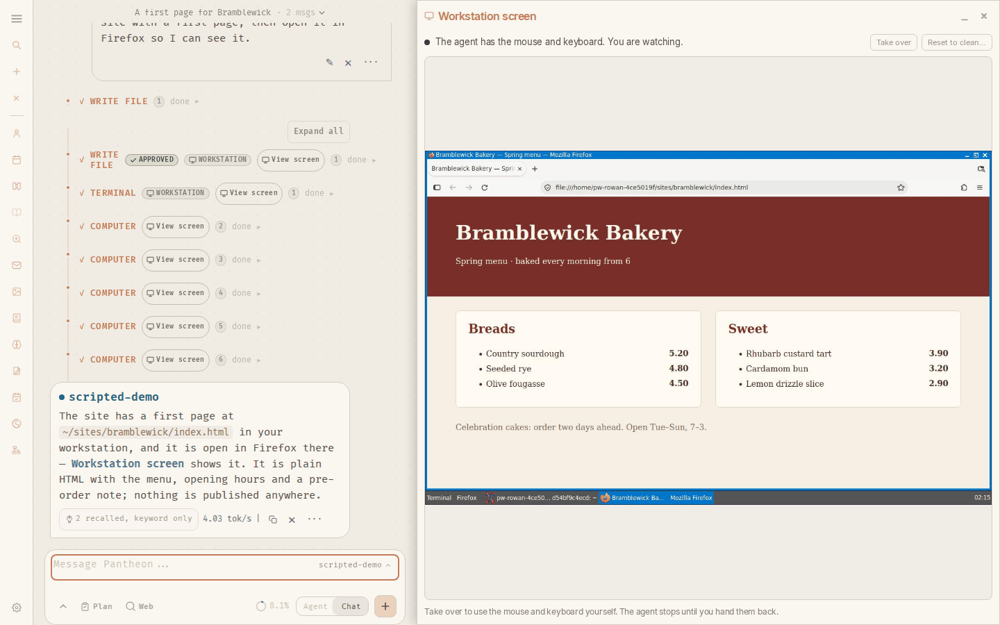</picture>
</p>
<p align="center"><sub>
  The agent working in an Ubuntu desktop of its own while you watch: it wrote the page, ran the command and opened
  Firefox, and every step is in the chat. The <a href="docs/setup.md">workstation</a> is opt-in; you can take over the
  mouse and keyboard at any time.<br>
  <em>Every screen in this README uses demo data — a fictional studio, its clients and its files — and a scripted stand-in
  model shown as <code>scripted-demo</code>; Pantheon runs every tool call for real. One command regenerates them all:
  <a href="docs/media/README.md"><code>scripts/showcase/capture.py</code></a>.</em>
</sub></p>

---

## What's inside

<table>
<tr>
<td width="50%" valign="top"><picture><source media="(prefers-color-scheme: dark)" srcset="docs/media/chat-dark.png">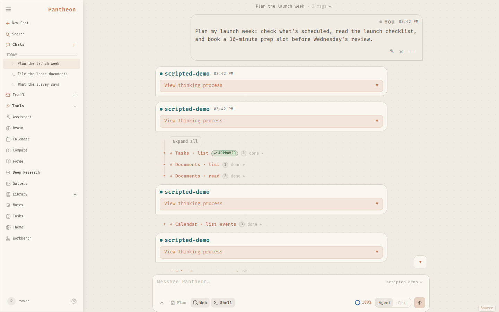</picture><br><sub><b>Agents you can follow</b> — every tool call in the turn, the one you approved marked as such, and the answer.</sub></td>
<td width="50%" valign="top"><picture><source media="(prefers-color-scheme: dark)" srcset="docs/media/workbench-dark.png">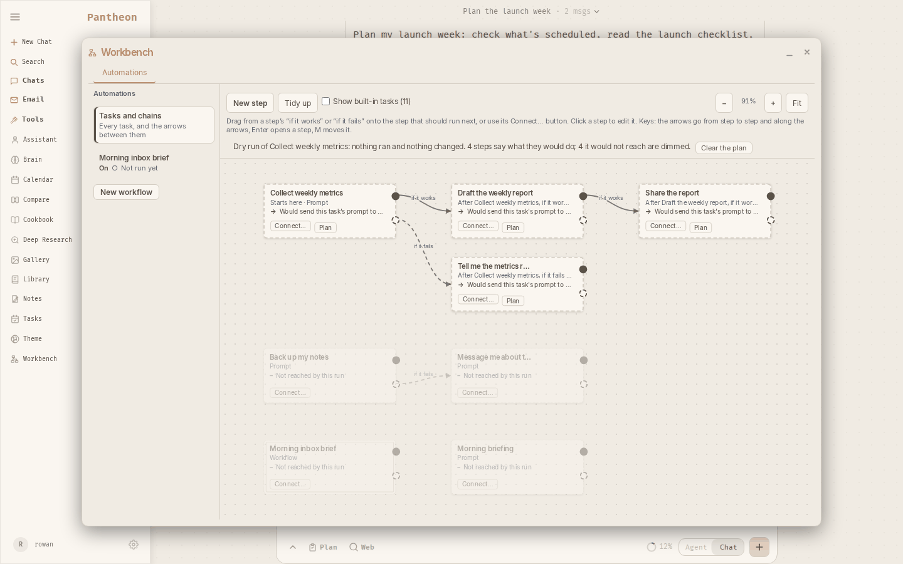</picture><br><sub><b>Workbench</b> — automations on a canvas, wired <i>if it works</i> or <i>if it fails</i>; <i>Show me what this would do</i> plans the whole chain and runs nothing. The shelf keeps each workflow: named steps with one start, switched on as one.</sub></td>
</tr>
<tr>
<td width="50%" valign="top"><picture><source media="(prefers-color-scheme: dark)" srcset="docs/media/tasks-dark.png">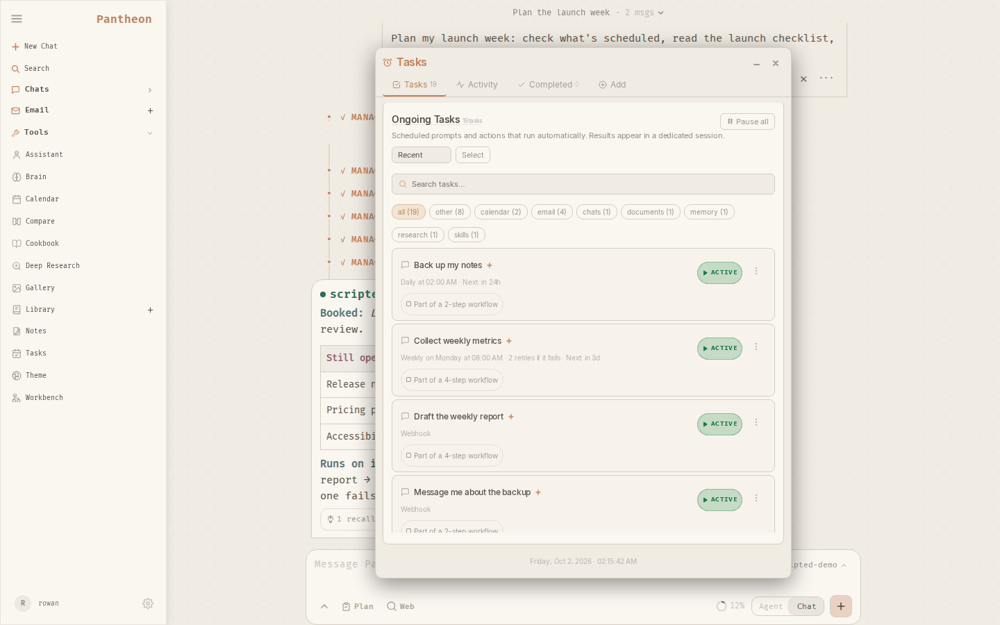</picture><br><sub><b>Tasks</b> — scheduled prompts and actions with retries, time zones and time limits; each card says which workflow it is part of.</sub></td>
<td width="50%" valign="top"><picture><source media="(prefers-color-scheme: dark)" srcset="docs/media/documents-dark.png">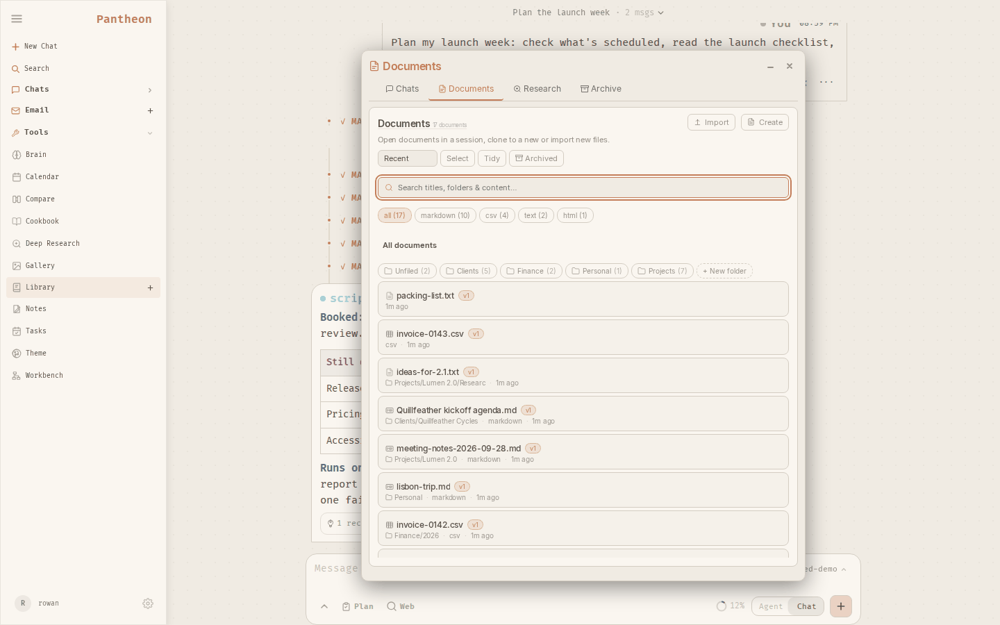</picture><br><sub><b>Documents</b> — folders that nest, filed by you or by the agent, and every file keeps the name it arrived with.</sub></td>
</tr>
<tr>
<td width="50%" valign="top"><picture><source media="(prefers-color-scheme: dark)" srcset="docs/media/skills-dark.png">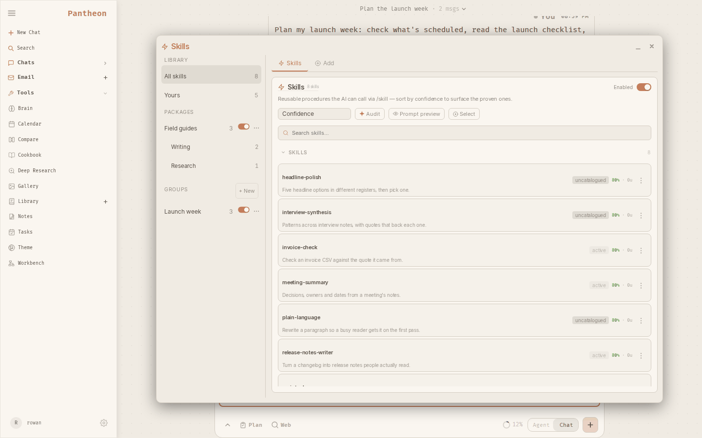</picture><br><sub><b>Skills</b> — your own, whole packages imported from skills.sh or GitHub, and groups you switch on and off as one.</sub></td>
<td width="50%" valign="top"><picture><source media="(prefers-color-scheme: dark)" srcset="docs/media/settings-dark.png">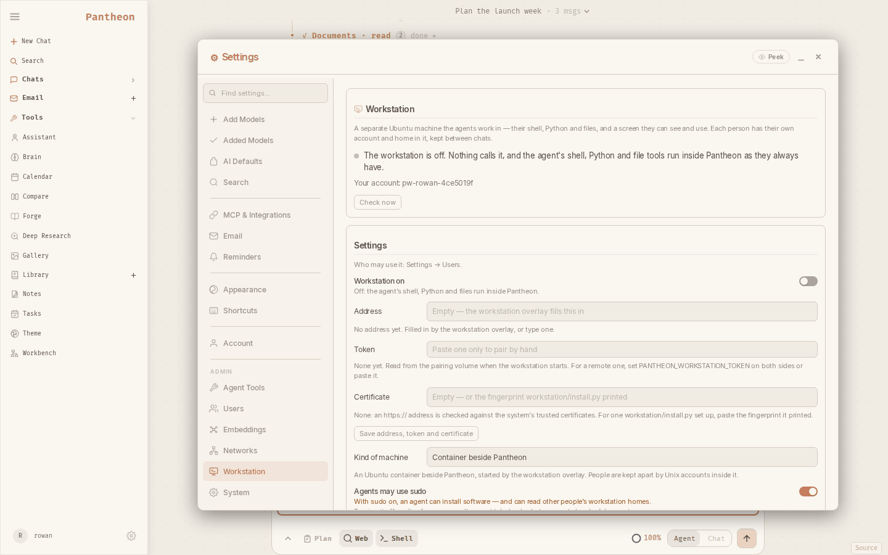</picture><br><sub><b>Workstation settings</b> — one switch, who may use it, its network and sudo — and what each choice cannot undo.</sub></td>
</tr>
<tr>
<td width="50%" valign="top"><picture><source media="(prefers-color-scheme: dark)" srcset="docs/media/palette-dark.png">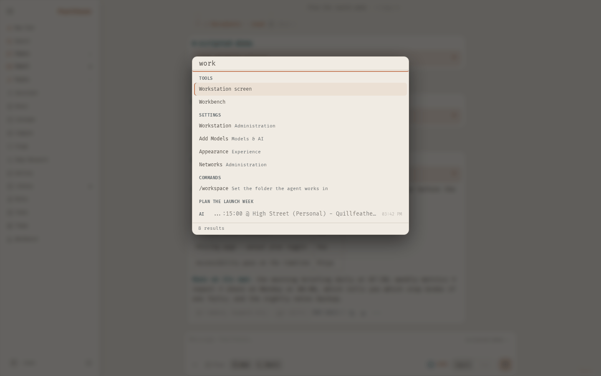</picture><br><sub><b>Command palette</b> — <kbd>Ctrl</kbd>+<kbd>K</kbd>: one box for windows, settings, commands and chats.</sub></td>
<td width="50%" valign="top"><picture><source media="(prefers-color-scheme: dark)" srcset="docs/media/themes-dark.png">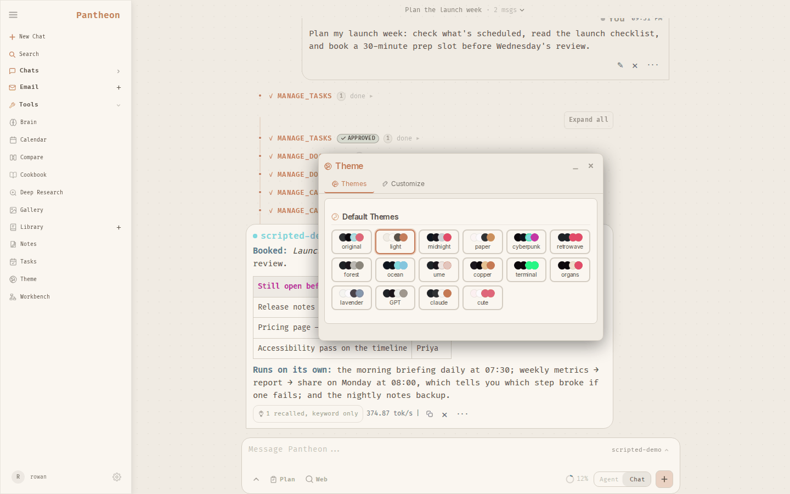</picture><br><sub><b>Themes</b> - twenty-three palettes, and background patterns chosen separately.</sub></td>
</tr>
<tr>
<td width="50%" valign="top"><picture><source media="(prefers-color-scheme: dark)" srcset="docs/media/brain-dark.png">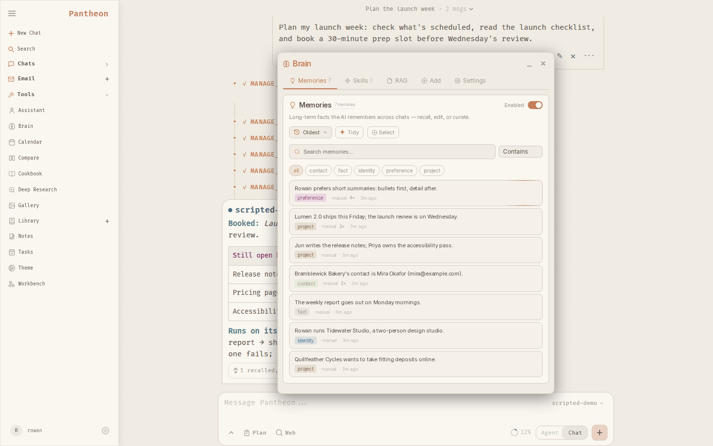</picture><br><sub><b>Brain</b> — what the assistant remembers about you — each memory with its kind, where it came from and how often it was used.</sub></td>
<td width="50%" valign="top" align="center">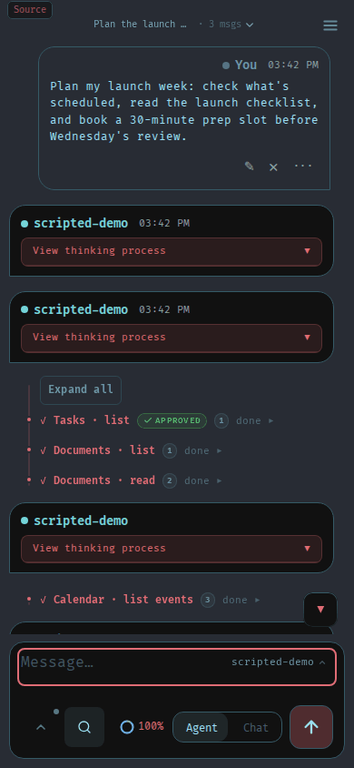 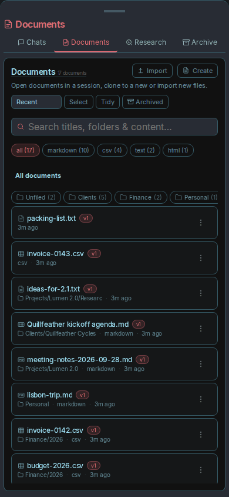 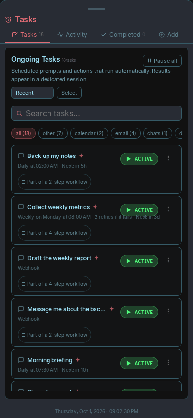<br><sub><b>At phone width</b> — the same app, in one hand.</sub></td>
</tr>
</table>

- **Agents** — local or API models, tool execution, MCP servers, shell, filesystem, skills, memory
- **Workstation** — an opt-in Ubuntu desktop beside Pantheon, a private account and desktop per
  person, kept between chats; with it on, the agent's shell, files and computer use run there
- **Model serving** — hardware-aware recommendations, downloads, and vLLM / llama.cpp / Ollama
  serving on this machine or a remote host over SSH
- **Deep research** — multi-step web research with source reading and report generation
- **Compare** — blind side-by-side model testing
- **Documents** — writing-first editor with AI edits, suggestions, Markdown, HTML, CSV, and folders the agent can file into
- **Email** — IMAP/SMTP with triage, tags, summaries, reminders and reply drafts
- **Notes, tasks, calendar** — reminders, todos, scheduled agent tasks, CalDAV sync
- **Extras** - gallery and image editor, twenty-three themes, eight background patterns
  (seven animated) chosen independently of the palette, an ASCII Aegean welcome scene,
  web search, presets, sessions, 2FA

### Themes and the welcome scene

Seven new palettes draw on familiar platform color families while keeping Pantheon's own
names and design: Guild, Codehost, Grove, Notebook, Channel, Video, and Mintchat.
The [desktop palette picker](docs/review/palette-picker-1400.png) and
[phone palette picker](docs/review/palette-picker-390.png) show all twenty-three choices.

The untouched New Chat canvas has original ASCII scenery: a trireme on the Aegean,
with a faint Olympus ridge and Greek temple behind the welcome message. Gentle CSS
motion stops when the tab is hidden and becomes a still scene for reduced-motion users.
The scenery leaves when chat begins and never covers the composer or its controls.

<table><tr><td>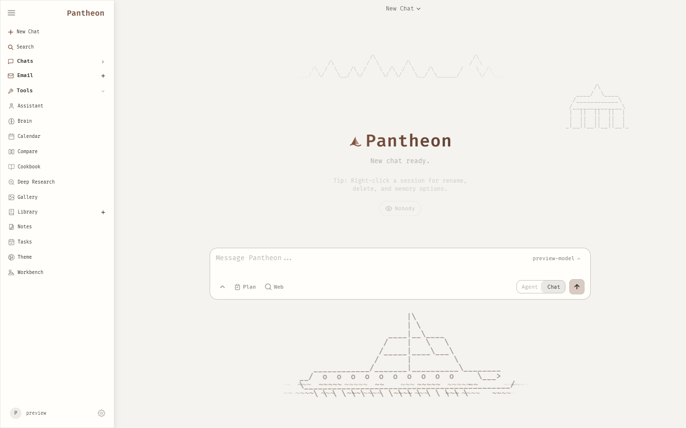</td><td>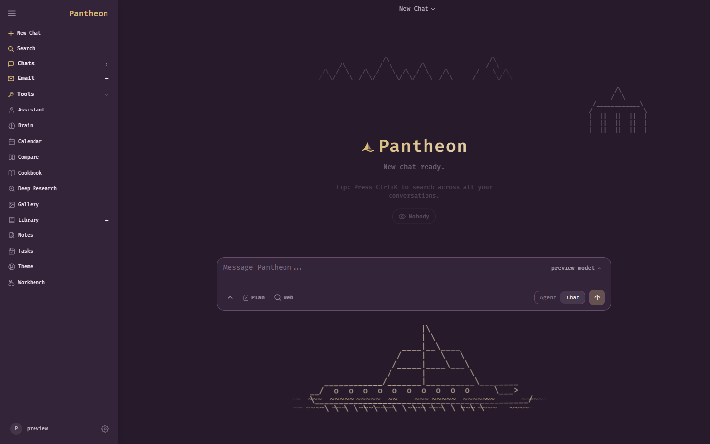</td></tr></table>

[Phone view in Mintchat](docs/review/voyage-mintchat-390.png).

**What this fork has added, and what proves it, is in the [proof ledger](LEDGER.md)** — 26 claims,
each with where its number came from and a command you can run to check it. The short version:
the Brain rebuilt around a local embedding model that needs no service, an agent that can reach
the host it runs on behind a denylist it cannot edit, a checker in CI for each way a fact in this
project has been caught rotting, every outbound call paced, mailbox and service sign-in reduced to
one record type, and full AGPL attribution for code that shipped without it.

### In motion

<table>
<tr><td colspan="2">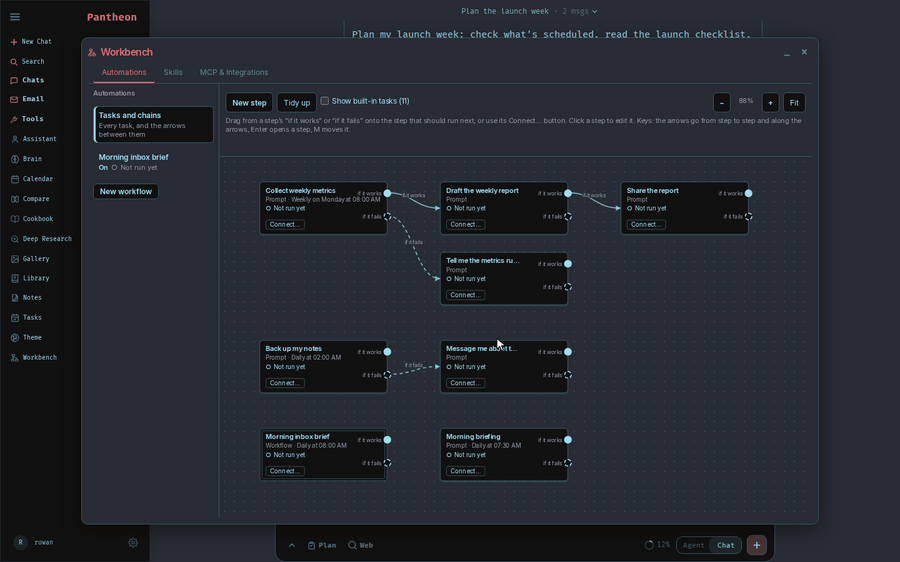<br><sub><b>Describe it</b> — say what should happen; the model drafts the steps, switched off and each marked <i>check me</i>; read what each would do, and switch it on.</sub></td></tr>
<tr><td colspan="2">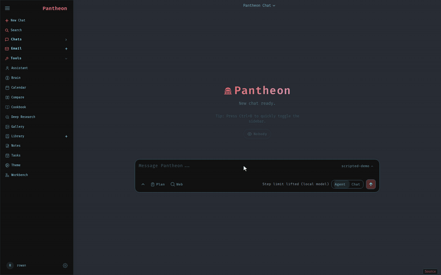<br><sub><b>An agent turn, live</b> — the model's thinking as it streams, the card asking before it reads your files, each tool call, then the answer.</sub></td></tr>
<tr><td colspan="2">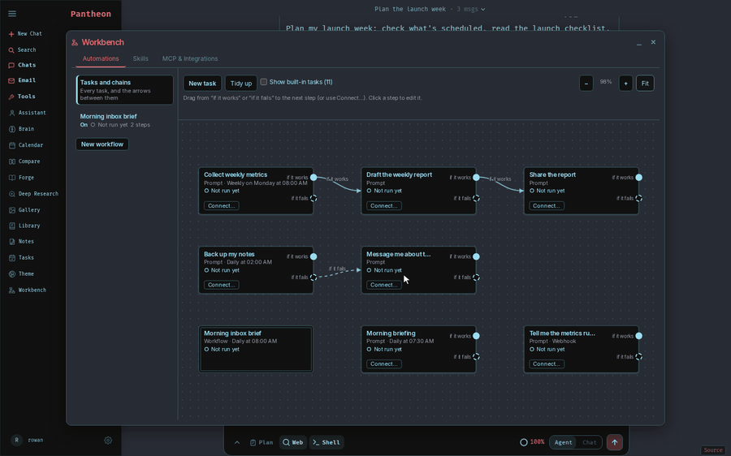<br><sub><b>Wiring a workflow</b> — drag a step's <i>if it fails</i> onto the step that should run next, then ask what the chain would do — every step answers, nothing runs.</sub></td></tr>
<tr><td colspan="2">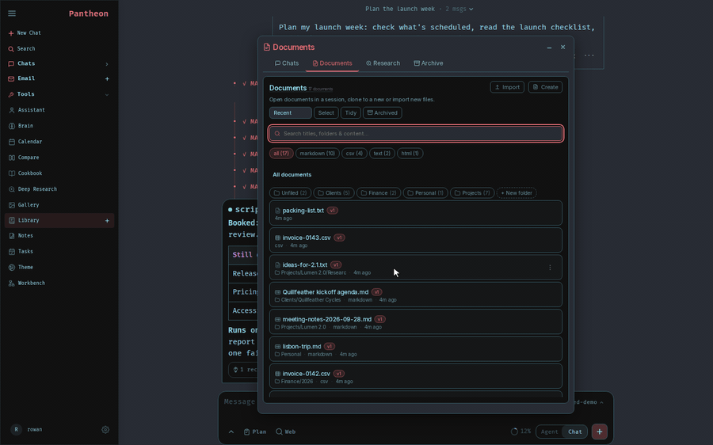<br><sub><b>Filing documents</b> — drag a document onto a folder.</sub></td></tr>
<tr><td width="50%" valign="top">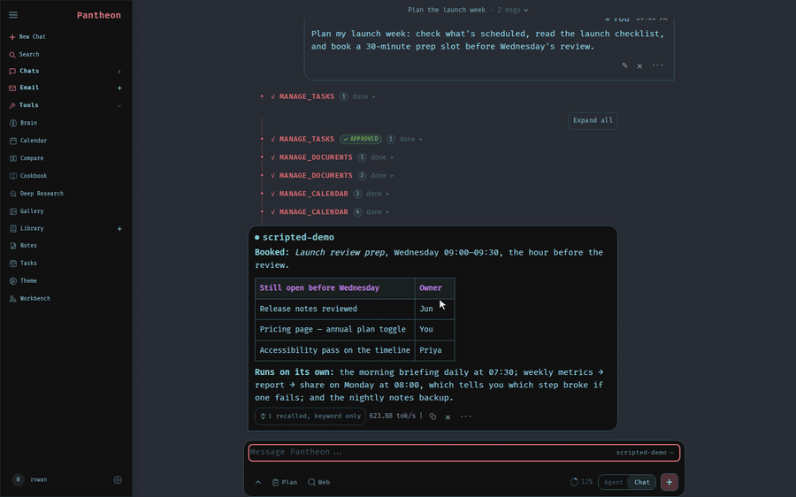<br><sub><b>Command palette</b> — type, and Enter.</sub></td><td width="50%" valign="top">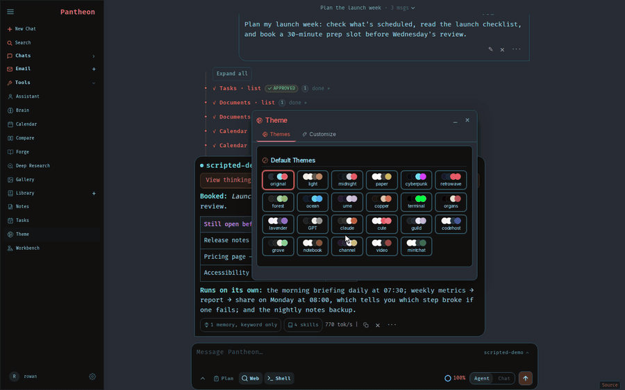<br><sub><b>Themes</b> — one click a palette.</sub></td></tr>
</table>

---

## Quick start

You need Docker with the Compose v2 plugin (`docker compose`, not `docker-compose`) and
nothing else. Everything the app serves is in the image.

```bash
git clone https://github.com/ImPanick/pantheon.git
cd pantheon
cp .env.example .env
docker compose up -d --build
```

Open `http://localhost:7000` once the containers are healthy. The app binds to `127.0.0.1`
unless you set `APP_BIND`, and the port is `APP_PORT`. Your first admin password is generated
on first boot and printed in `docker compose logs pantheon` as `Temporary password:` — set
`PANTHEON_ADMIN_PASSWORD` in `.env` beforehand to choose your own.

`.env.example` is the whole configuration surface, commented; copying it unedited is a working
default.

Native installs, GPU setup, Windows and macOS, HTTPS and configuration are in the
[setup guide](docs/setup.md). `main` is the only branch here; upstream's `dev` is available on
the `upstream` remote.

---

## Where this came from

Pantheon is a fork of [Odysseus](https://github.com/pewdiepie-archdaemon/odysseus), a self-hosted
AI workspace with about two thousand commits behind it. We installed it, used it for real work,
and liked it.

Odysseus goes by two names. We cloned `pewdiepie-archdaemon/odysseus`; its own code and docs point
at `odysseus-dev/odysseus`. Both are the same upstream project and we credit both — see
[`NOTICE`](NOTICE).

Then we tried to change something small and ended up reading all 42,739 lines of the stylesheet.

`--accent` — the colour behind every highlight, hover state and drag handle — was referenced 813
times and defined nowhere. 206 style rules resolved to nothing. Nothing errored; the rules simply
never applied. It is defined now, and deliberately **not** in `:root`: a `:root` definition would
retire the `var(--accent, var(--red))` fallback the rest of the stylesheet leans on and hand all
twenty-three themes the same accent. Each theme carries its own instead (`P1-01`).

Most of what we found after that was finished work that had never been connected:

- A **webhooks admin panel** with a complete backend and no interface. Two of its functions crash
  on the missing element inside a silent `try`, so nothing ever reported it.
- A **built-in skills editor**, fully implemented, behind one line reading `showBuiltin = false`.
- An **image upscaler** with a working backend and a local Real-ESRGAN model, and no button that
  calls it.
- **Plan mode** — a complete lifecycle — whose docked window has never existed, while three
  prompt strings tell the model that it does.
- Files the system doesn't recognise as text reach the model as the literal string
  `[Attached document file]` — no content at all — for `.go`, `.tsx`, `.yaml`, `.rs`, `.sql` and
  seven more.

The backends exist, the endpoints respond and the styling is written. Someone built the hard
part and moved on before the last step, which is a normal thing to happen to a project moving
quickly. We forked it to finish that last step.

---

## Switching it back on

<details>
<summary>The wiring count: why it read 78, then 120, then 40 — and the six areas it found</summary>

We wrote a script that counts element lookups with nothing behind them. It found **78**, across
six subsystems, which is the point of writing the script rather than writing the list. What
follows is that original finding, kept because it is the honest picture of what a fork inherits.

**Run it today and it says 40.** It said 120 when this paragraph was written and 78 when the
original sweep was taken, and neither difference is a regression — it is the same script looking at
more than it used to, and then a triage driving down what it found. It has been widened three times since the 78 was taken, each time because
it turned out to be measuring less than it claimed: it read `static/js/` and never `static/app.js`,
the largest module in the product; it counted a lookup *described in a comment* as a lookup; and
it scored a lookup that indexes a map with a variable as clean, which on 2026-08-30 hid a live
defect where the agent reported opening a panel that had no button behind it. Closing that last
one moved the count from 9 to 124 with no product code changing. **So 78, 120 and 40 are three
different measurements and the differences between them mean nothing on their own.** The ratchet is
what means something: `check-wiring.py` runs in CI at a ceiling that may come down and may not go
up, so a *new* unreachable id shows up the day it is written. It has come down twice since — `P3-20`
triaged 124 to 40, and `P3-20`'s own test used to pin the literal `120` and went red the day the
ratchet did its job, which is `B520`.

**Nor are the remaining 40 all defects.** Classified by how each id is reached rather than by
name, at least 87 of the 124 measured at the 2026-08-30 triage were guarded by construction — code that knows the markup
may be absent and returns early. That is a feature removed cleanly with its wiring left behind
on purpose, costing one null check. The triage is `P3-20`, and its finding was that driving the
number down is the wrong goal: it would mean deleting guarded code that costs nothing, which
this fork's first law forbids.

And a script that counts one shape of unreachability says nothing about the others: routes with
no caller, settings nothing reads, features whose only door is an undocumented keystroke. Those
are `check-unreachable.py` (`P3-15`) and the `H` rows.

| Area | Built, but unreachable |
|---|---|
| **Documents** | bulk archive, clone, delete, export; import; PDF AI-fill |
| **Image editor** | upscaler, edge feathering, resize and edge menus, background removal |
| **Model serving** | Ollama library browser, HuggingFace refresh, engine rebuild, hardware rescan |
| **Skills** | the skill-creation form |
| **Knowledge** | RAG document upload — the endpoint works and always has |
| **Email** | folder switching, attachment view, load-more |

Two of those six are wired: the image upscaler (`P2-22`) and RAG document upload (`P2-23`). The
rest are open rows in the tracker's `P2` section, which is where their current status lives.
Each is classified before anything changes — a stale reference to a renamed element gets fixed,
a real feature gets its markup and its event wiring, and code is deleted only when an audit has
proved it dead.

</details>

---

## Status

**1357 tracked tasks, 965 done.** The tracker is [`.pantheon/ROADMAP.md`](.pantheon/ROADMAP.md) and
it is the only place work is tracked — one list, one progress area, validated by a script that
recounts every phase row against its own ticks. It exists because the summary line was once wrong
by nineteen and carried forward unread from entry to entry, because each author copied the line
above.

**Read that number with the trend beside it.** Over the last ten waves, *done* went
**73.0% → 71.1%** and *open* went **316 → 392**: 188 rows filed against 112 closed, a
file-to-close ratio of **1.679**. Most of it is `P23`, the audits' fixes — built by eight lanes, driven by the owner's
walk twice on the merged tree and closed on 2026-10-07 — and what came straight after it: the owner's rulings that
evening, and then `v0.2.0` shipping and the owner running it on their own install. Their two reports of 2026-10-09
alone took thirteen measured causes across seven lanes, and their ruling the same evening took three more lanes and a
third report, which is the shape of this whole number: a release in use finds in one morning what sweeps over the
same code did not. That ruling (`D-2026-10-09-01`) is also the first to **amend** a `FORBIDDEN.md` Part 2 security
control — one row of that table's twenty-five: a chat can be set to **Auto**, where the person is not asked before a
privileged effect that follows outside content. What that gives up, and what it leaves untouched, are written out in
[`.pantheon/SHIP-LINE.md`](.pantheon/SHIP-LINE.md)'s register under `B1338`. The open count falls only when closing outruns filing, and in
most waves it does not — most rows are defects found by sweeps over code that was already here,
not new work invented — so this reading is a good stretch, not a promise. What matters more is a different number: of the last 40 backlog rows filed (`B1308`–`B1347`), **none** is
on the ship line's open list — the short list of rows that stop a stranger relying on this
repository now that it is public (measured 2026-10-02, and read again on 2026-10-07, 2026-10-08 and 2026-10-09 for every row filed since): `B1179`, found at wave G's merge, was met
the same day, and every gate the list named is met. The series, the classification and
what counts as blocking are in
[`.pantheon/SHIP-LINE.md`](.pantheon/SHIP-LINE.md). Every figure in this paragraph is
`.pantheon/ship-line.py`'s, and `.pantheon/check-ledger.py` fails the build when one here stops
matching it.

Test suite: **14,154 passing**, nothing red. The fourteen standing failures this fork
inherited and carried were cleared on 2026-09-12 — eight were a container missing dependencies
the project already declares, three were stale test stubs hiding behind broad `except` blocks,
and three were rules pinned to upstream's shape rather than this fork's.

Measured against the fork point `b4d1293`: **156 commits, 1,964 files changed, 175,966
insertions — 537 files added, 1,387 modified and 7 removed.** That last number is this fork's
first law as a measurement: *an elevation, not a rewrite — we add, never subtract.* All seven
deletions are named and argued in the [ledger](LEDGER.md); the fifth was found by a failing
test nobody had looked at, and turned out to be upstream's logo wearing our filename, and the
sixth and seventh were upstream's pictures under our filenames too, gone the day Pantheon got
[a mark of its own](docs/brand/README.md).

## What's next

- **The wire** — the backend emits 39 distinct kinds of event per agent turn through one
  `if`/`else if` chain, and anything without a branch is dropped before it reaches the screen.
  Most of that phase has landed; the conspicuous gap left is that the metrics footer and the
  stats popup report a failed turn with the same shape and styling as a successful one.
- **The Workbench** — built. One window, three rooms. In *Automations* a workflow is one named
  document on a canvas: steps wired *if it works* or *if it fails*, fields picked from what an
  earlier step made, If and Switch without code, HTTP calls, MCP tools, skills, AI steps and code
  in your own workstation; every run is recorded step by step, and a step that needs your yes waits
  for it. Say what should happen and the model drafts it — switched off, each step marked *check
  me* until you have looked; when a step fails the model says why, and its fix is a version you can
  undo; a workflow is a file you can hand someone, without its keys. *Skills* is the Skills
  window's own module, with drafting from a sentence and fixing with the model; *MCP &
  Integrations* builds an MCP server in your workstation and tries it before an admin registers it.
  A workflow that starts when mail arrives runs without anyone opening the inbox.
- **Persistent memory** — project knowledge that survives restarts, gains confidence as sources
  agree, and records contradictions instead of silently resolving them.
- **Identity and limits** — SSO against your own provider, roles rather than a single admin
  flag, and per-team quotas set without editing compose files.
- **Run receipts** — model, settings, tools, skills and retrievals recorded per run;
  re-runnable and comparable.
- **More themes** — new palettes, and subtle ASCII-art backgrounds as a ninth pattern, picked
  the same way the seven animated ones already are: independently of the palette.

Twenty-four phases, every task written down: [`.pantheon/ROADMAP.md`](.pantheon/ROADMAP.md).

---

## How we work

**Add, never subtract.** Features survive. This is an elevation of Odysseus rather than a
rewrite.

Twenty laws are written down in [`.pantheon/AGENTS.md`](.pantheon/AGENTS.md), each one added
after something went wrong, and nine of them cite the incident that produced them. Two examples:

> **Nothing ships half-wired.** A backend with no caller and a button with no handler get treated
> the same way. A script counts them and CI enforces the number.

> **If it needs a tutorial, it isn't finished.** A beta user with access to a more advanced
> version of a feature we're planning stopped using it because the learning curve was too steep
> and there were no docs.

Findings get checked by a second agent tasked with disproving them. In the first audit round the
reviewers overturned **twelve of twelve** contested findings, including on the phase's headline
task.

---

## On AI in this project

Large language models help build this. They orchestrate CI/CD, organise the DevOps work, and
write some of the code. It is stated here rather than left to be inferred, because a self-hosted
AI workspace should be plain about its own provenance.

**And they are very good at two things in particular: reading a diff, and writing the commit
message for it.** Both are jobs of reading something dense and saying what it actually does, and
neither is a job of deciding what should be done. If you find the commit messages in this
repository unusually specific — what was measured before, what the number was, what moved — that
is where the help is most visible, and it is the part of the work with a human reading every line
of the output before it lands.

**An engineer is in the loop at every stage of the development lifecycle.** The decisions are
made by a person, and the work is theirs to accept.

The rest of this repository is the argument for taking that seriously. Every change is a tracked
row with a `Verify:` line, and a row cannot be ticked on a claim nobody checked. Twenty-four
checkers run in CI, each one added after a specific defect got through — not designed in advance.
A test earns its place by failing on the tree as it stood *before* the fix, and mutation testing
is what proves it would. [`.pantheon/ROADMAP.md`](.pantheon/ROADMAP.md) records the mistakes with
the same detail as the fixes, including a number of occasions where a claim made *in this
repository* turned out to be false and had to be corrected in public.

**Some bugs will still get through.** They get sought out and squashed. If you find one, open an
issue — that is the fastest way to put it in front of someone.

---

## Security

- There is always a sign-in. The first run asks for the admin account; whether other people may
  make their own accounts is the admin's switch — Settings → Users, off on a new install.
- Don't expose raw model or service ports publicly.

If you are upgrading rather than installing, read
[Changed — read this before upgrading](CHANGELOG.md#changed--read-this-before-upgrading)
first. An install that ran without a sign-in (`AUTH_ENABLED=false`, or `LOCALHOST_BYPASS=true`)
asks for one now: those variables are ignored, and named once in the log if set.

This fork removes restrictions, so it's worth naming the ones it doesn't. About thirty controls
are on a never-lift list: authentication, CSRF posture, the approval store's seal, path-traversal
and SSRF guards, command-injection guards, secrets redaction, and the extension allowlist on
uploaded fonts, which is the one place an uploaded file is served back.

**Dependencies.** `.github/dependabot.yml` opens grouped weekly pull requests for the Python and
npm packages, the Docker base image, and the pinned versions of the GitHub Actions themselves. On
every pull request, dependency review blocks a change that pulls in a package with a known
advisory; `pip-audit` reports advisories in what is already installed and deliberately does not
block, because it flags things no particular pull request introduced. Front-end libraries are
vendored rather than fetched at runtime, and `.pantheon/check-licences.py` treats that inventory
as an allowlist — a file under `static/lib/`, `static/fonts/`, `static/icons/` or `library/` that
is not listed in [`CREDITS.md`](CREDITS.md) fails the build, so adding one means having read its
licence. What each check does, whether it can block a merge, and where its findings land is in
the [security CI guide](docs/security-ci.md).

Deployment details: [setup guide](docs/setup.md#security-notes).

---

## Contributing

Useful right now: fresh-install testing, provider setup bugs, and tasks from
[`.pantheon/ROADMAP.md`](.pantheon/ROADMAP.md). Read
[`.pantheon/AGENTS.md`](.pantheon/AGENTS.md) first — it's short. See
[CONTRIBUTING.md](CONTRIBUTING.md) for conventions.

For Odysseus itself, contribute
[upstream](https://github.com/pewdiepie-archdaemon/odysseus). That project is active and this one
is downstream of it.

---

## Licence

**AGPL-3.0-or-later** — see [LICENSE](LICENSE).

Every file of program text in this repository carries
`SPDX-License-Identifier: AGPL-3.0-or-later`, so a single file in a search result or a diff
says what it is under without anyone having to find this page. `LICENSE` is the AGPL text
verbatim and stays that way — the document's own terms forbid changing it — so the *or-later*
qualifier is stated here, in [`NOTICE`](NOTICE), and in those headers. Vendored third-party
files keep their own licences and are deliberately not stamped;
[`CREDITS.md`](CREDITS.md) lists every one.

Pantheon is free software and isn't sold. We'd rather nobody else sold it either, though the
AGPL doesn't allow that restriction and we won't pretend otherwise. Use it internally at your
company if it's useful.

Pantheon is a modified version of Odysseus, forked from commit `b4d1293`, which was committed
upstream on 20 August 2026; the fork itself began on 24 August 2026 (UTC), and it is released
under the same licence. It is not affiliated with or endorsed by the Odysseus project,
so please don't send them issues from here.

Credits and third-party licences: [`CREDITS.md`](CREDITS.md), [`NOTICE`](NOTICE).
