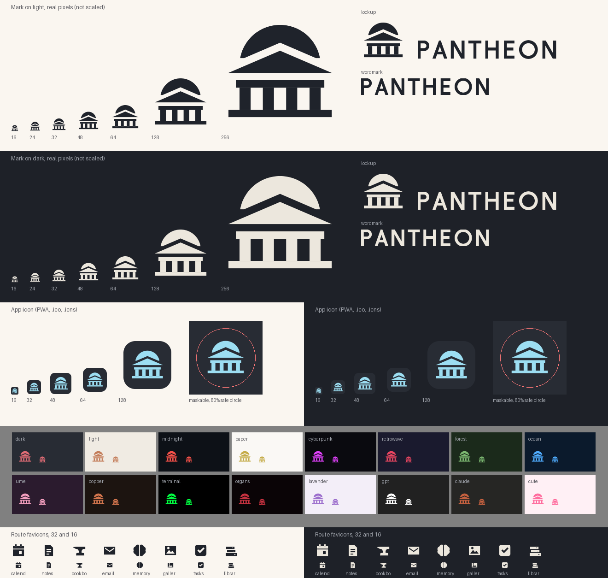

# Pantheon's mark



The Pantheon in Rome seen from the front: a portico — pediment, entablature, four
columns, a step — with the rotunda's dome cresting behind the pediment. The dome is
what makes it this building and not the generic "bank" pictogram. Beside it,
**PANTHEON** in spaced monoline capitals, the way a name is cut into an architrave.

It is deliberately simple, and it is a placeholder in the honest sense: the owner
asked for *"a simple mark"* so that nothing of upstream's ships (`D-2026-10-02-03`
§2), and may replace it with artwork of their own. Nothing depends on this design
beyond the files below.

## Files

Everything here is written by [`scripts/branding/make_marks.py`](../../scripts/branding/make_marks.py)
from one description of the shapes. Do not edit the outputs by hand — change the
script and run it.

| File | What it is for |
|---|---|
| `pantheon-mark.svg` | The mark in `currentColor`, 32-unit square. **The source of truth** the app's inline copies are tested against. |
| `pantheon-mark-light.svg`, `pantheon-mark-dark.svg` | The mark for a light background (slate ink) and a dark one (marble ink). |
| `pantheon-wordmark-light.svg`, `pantheon-wordmark-dark.svg` | The name alone. |
| `pantheon-lockup-light.svg`, `pantheon-lockup-dark.svg` | Mark and name side by side, on one baseline. |
| `pantheon-app-icon.svg`, `pantheon-app-icon-maskable.svg` | The app icon: the mark on the default palette's slate, as a rounded square and full-bleed. |
| `pantheon.icns` | macOS app icon; `build-macos-app.sh` copies it into `Pantheon.app`. |
| `routes/*.svg` | The eight per-route favicons (`/calendar`, `/notes`, `/cookbook`, `/email`, `/memory`, `/gallery`, `/tasks`, `/library`), in `currentColor`. |
| `png/pantheon-mark-light-32.png`, `png/pantheon-mark-light-256.png`, `png/pantheon-mark-light-1024.png` | Mark renders for light backgrounds, transparent. |
| `png/pantheon-mark-dark-32.png`, `png/pantheon-mark-dark-256.png`, `png/pantheon-mark-dark-1024.png` | Mark renders for dark backgrounds, transparent. |
| `png/pantheon-wordmark-light-48.png`, `png/pantheon-wordmark-light-192.png`, `png/pantheon-wordmark-dark-48.png`, `png/pantheon-wordmark-dark-192.png` | Wordmark renders (the number is the cap height). |
| `png/pantheon-lockup-light-64.png`, `png/pantheon-lockup-light-256.png`, `png/pantheon-lockup-dark-64.png`, `png/pantheon-lockup-dark-256.png` | Lockup renders (the number is the height). |
| `png/pantheon-app-icon-1024.png` | The app icon at 1024 px. |
| `contact-sheet.png` | Everything above at the sizes it is seen, on light and dark, and in all sixteen palettes. |

The script also writes the files the product ships: `static/icon.ico` (the Windows
exe and tray icon, 16–256 px, each size drawn at that size),
`static/icons/icon-192.png` and `static/icons/icon-512.png` (PWA, purpose `any`) and
`static/icons/icon-maskable-512.png` (PWA, purpose `maskable`, the mark inside the
80% safe circle).

## Using it

- **In the app** the mark is drawn in `currentColor`, which the welcome screen and
  the login card set to the palette's brand colour, and the favicon takes the
  palette's accent — so it is in every palette's own colours, never in the inks
  above. The name beside it is live text, not the wordmark picture.
- **On a page or a slide**, use the `-light` files on light backgrounds and the
  `-dark` files on dark ones. Prefer the SVGs; the PNGs are for places that cannot
  take one.
- **Smallest size:** the mark is drawn to hold at 16 px (its horizontals fall on
  whole pixels there); the wordmark needs at least 10 px of cap height.
- **Clear space:** leave at least the dome's height — a quarter of the mark — clear
  on every side.
- Do not recolour the app icon's tile, add shadows or outlines, or redraw the name
  in a typeface and call it the wordmark.

## Changing it

```bash
python3 scripts/branding/make_marks.py           # write every file
python3 scripts/branding/make_marks.py --check   # compare, write nothing
```

Pillow is the only requirement (the app already installs it). No font is read and
nothing is fetched: the capitals are built from rectangles, lines and arcs in the
script. `tests/test_pantheon_has_its_own_mark.py` fails if a committed file is not
what the script draws, or if the mark inlined in `static/index.html`,
`static/login.html`, `static/js/theme.js` and `docs/index.html` is not
`pantheon-mark.svg`'s path — so to replace the mark, change the script (or replace
`pantheon-mark.svg` and the static icons together), then update those four inline
copies.

## What it replaced

Upstream's red sailing boat — in the favicon, on the login card and the welcome
screen, in the tray and in the PWA and Windows icons — and a screenshot of
upstream's UI that the macOS build used as its app icon (`P0-13`, `B71`). The
licence allowed reusing them; they are upstream's identity, so they are gone.
`.pantheon/check-fork-names.py` keeps them out: it fails on upstream's images by
their exact bytes, on near copies by a perceptual hash, and on the boat's SVG path
data in code.

## Licence

Part of this repository, under the same licence: AGPL-3.0-or-later.
